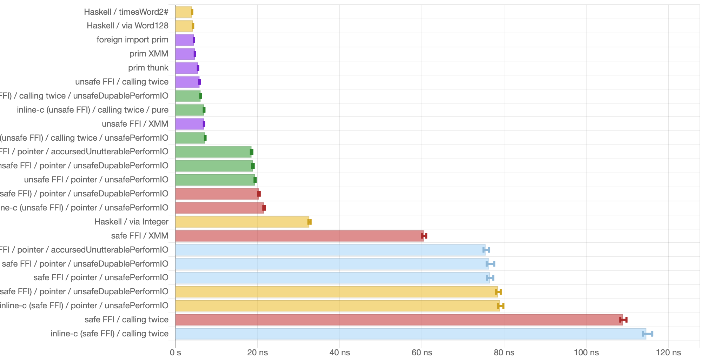

This article is an English version of my earlier post "[【低レベルHaskell】Haskell (GHC) でもインラインアセンブリに肉薄したい！](https://qiita.com/mod_poppo/items/793fdb08e62591d6f3fb)" (in Japanese). The translation was assisted by AI (if you don't like reading AI-generated content, please read the Japanese version!).

Modern CPUs have many instructions specialized for particular purposes. Examples include SIMD, instructions useful for hashing and cryptography, and a variety of others. C and C++ have inline assembly and intrinsics, which let you write code that takes advantage of such instructions.

Haskell (GHC), on the other hand, has no such mechanism. But that's no reason to give up just yet. Let's find a way to invoke obscure CPU instructions from Haskell, and as efficiently as possible.

First, let me list a few CPU instructions that would be nice to use from Haskell.

## The subject: the high and low halves of a product of 64-bit integers

Consider computing the product of two 64-bit integers, obtaining both the high 64 bits and the low 64 bits (128 bits in total).

The ordinary multiplication found in C and Haskell, `(*) :: Word64 -> Word64 -> Word64`, can only compute the low 64 bits. At the machine-code / assembly level on x86, however, the high 64 bits are computed alongside the product as well.

For this kind of processing — "easy at the machine-code level, but non-trivial at the C or Haskell level" — we'd like to use inline assembly or intrinsics.

(Actually, GHC has an intrinsic `timesWord2# :: Word# -> Word# -> (# Word#, Word# #)`, so you can do this in one shot using it. I chose this subject anyway so that we can measure how much slower the alternatives get compared to a GHC intrinsic.)

As another subject, **carry-less multiplication** (polynomial multiplication over a finite field) would also be useful for certain purposes. I won't go into detail in this article, but I've placed the test results in the repository.

### In C

GCC/Clang have the `__int128` type, so you can compute this in one shot using it. No inline assembly or intrinsics required.

```c
unsigned __int128 wideningMul(uint64_t a, uint64_t b)
{
    return (unsigned __int128)a * (unsigned __int128)b;
}
```

If we deliberately wrote it with inline assembly, it might look like this:

```c
uint64_t wideningMul_inlasm(uint64_t a, uint64_t b, uint64_t *outHigh)
{
    uint64_t lo, hi;
    asm("movq %2, %%rax;"
        // mulq computes the product of %rax and the operand (here %3),
        // placing the high 64 bits in %rdx and the low 64 bits in %rax
        "mulq %3;"
        "movq %%rax, %0;"
        "movq %%rdx, %1;"
        : "=r"(lo), "=r"(hi)
        : "r"(a), "r"(b)
        : "%rax", "%rdx");
    *outHigh = hi;
    return lo;
}
```

## How to return multiple values

Now, this operation takes two `uint64_t`s and returns a 128-bit value — that is, two `uint64_t`s. Since C's syntax has no multiple-value return, you have to choose one of the following ways to return the values:

* Return a struct by value: define a struct like `struct uint128 { uint64_t lo, hi; }` and return it by value.
    * Returning `unsigned __int128` by value corresponds to this internally. See the x86_64 ABI for details.
* Take and pass a pointer: take the location where the second and later return values should be stored as a pointer argument.
    * Example: the `wideningMul_inlasm` function I wrote earlier.

As an example of the former, the C standard `div`, `ldiv`, and `lldiv` functions return a `{,l,ll}div_t` struct by value.

The advantage of returning a struct by value is that, depending on the ABI, if the struct is small the values can be returned while kept in registers.

The disadvantage, on the other hand, is that other languages' C FFI may not support it. In fact, GHC's current C FFI does not support passing structs by value.

There is a proposal to make C structs passable by value through the FFI, but it has seen no movement:

* [c structures · Wiki · Glasgow Haskell Compiler / GHC · GitLab](https://gitlab.haskell.org/ghc/ghc/-/wikis/c-structures)
* [Support C structures in Haskell FFI (#9700) · Issue · ghc/ghc](https://gitlab.haskell.org/ghc/ghc/-/issues/9700)

## Using the C FFI (with a pointer)

### Safe FFI

When there's something Haskell can't do, let's borrow the power of another language! To that end, Haskell has an FFI. With it, you can call functions written in C.

Let's give it a try right away:

```c
#include <stdint.h>

extern uint64_t wideningMul_with_ptr(uint64_t a, uint64_t b, uint64_t *outHigh)
{
    unsigned __int128 result = (unsigned __int128)a * (unsigned __int128)b;
    *outHigh = (uint64_t)(result >> 64);
    return (uint64_t)result;
}
```

As I wrote earlier, the current GHC FFI can't pass structs by value, so we'll pass one of the return values via a pointer.

The Haskell side looks like this:

```haskell
foreign import ccall "wideningMul_with_ptr"
  c_wideningMul_with_ptr :: Word64 -> Word64 -> Ptr Word64 -> IO Word64

wideningMulWithPtr :: Word64 -> Word64 -> Word128
wideningMulWithPtr !a !b = unsafePerformIO $ do
  Marshal.alloca $ \outHigh -> do
    lo <- c_wideningMul_with_ptr a b outHigh
    hi <- peek outHigh
    return $ Word128 hi lo
```

Dealing with a pointer means performing `IO` in order to allocate space and read out the value. However, the operation as a whole ("multiplying two 64-bit integers") can be considered pure, so I've used `unsafePerformIO` to write it as a pure function[^unsafePerformIO].

[^unsafePerformIO]: Those well-versed in Unsafe Haskell might think, "In this case you could use `unsafeDupablePerformIO`, or even better, `****PerformIO`…" Don't worry, I've included the results of those experiments at the end as well.

(By the way, for the `Word128` type I used the `Data.WideWord.Word128` type from the `wide-word` package.)

Trying it out:

```haskell
> wideningMulWithPtr 123 456
56088
> 123 * 456
56088
> wideningMulWithPtr (2^63) (2^62) -- using a CPU instruction
42535295865117307932921825928971026432
> 2^125 -- computing with arbitrary-precision arithmetic
42535295865117307932921825928971026432
```

So it seems to be computing correctly.

If writing the C code in a separate file is a hassle, using a package like [inline-c](http://hackage.haskell.org/package/inline-c), as in

- @tanakh's article "[Haskellにインラインアセンブリを書く](https://qiita.com/tanakh/items/08c15f6e72dbe2da61a8)" (Writing inline assembly in Haskell, in Japanese)

might be one option.

### Unsafe FFI

Now, Haskell's FFI has a concept called the safety level. The default is `safe`, which means "it is safe for the called external code to call back into Haskell functions."

The opposite of `safe` is `unsafe`, which means "who knows what happens if the called external code calls back into Haskell."

An unsafe FFI carries risk, but in exchange it can be expected to have lower overhead.

You specify the safety level by writing `safe` or `unsafe` right after the calling convention in a `foreign import` declaration:

```haskell
foreign import ccall unsafe "wideningMul_with_ptr"
  c_wideningMul_with_ptr :: Word64 -> Word64 -> Ptr Word64 -> IO Word64
```

When using the inline-c package, you use the quasiquoters (`exp`, `pure`, `block`) found in `Language.C.Inline.Unsafe`.

## Using the C FFI (calling twice)

In the previous section, we went through a pointer in order to return multiple values from a function written in C.

However, passing values via a pointer is presumably slower than passing them in registers<sup>[citation needed]</sup>. You also need to allocate a memory region (GHC's `alloca` function allocates on the heap, not the stack). If we can pass the values without using a pointer, so much the better.

Fortunately, our subject — "multiplying 64-bit integers" — is a low-cost operation. Given that, wouldn't it be acceptable to perform the same computation for each of the high 64 bits and the low 64 bits separately?

```c
// compute the low 64 bits
extern uint64_t wideningMul_lo(uint64_t a, uint64_t b)
{
    unsigned __int128 result = (unsigned __int128)a * (unsigned __int128)b;
    return (uint64_t)result;
}

// compute the high 64 bits
extern uint64_t wideningMul_hi(uint64_t a, uint64_t b)
{
    unsigned __int128 result = (unsigned __int128)a * (unsigned __int128)b;
    return (uint64_t)(result >> 64);
}
```

```haskell
foreign import ccall unsafe "wideningMul_lo"
  c_wideningMul_lo :: Word64 -> Word64 -> Word64

foreign import ccall unsafe "wideningMul_hi"
  c_wideningMul_hi :: Word64 -> Word64 -> Word64

wideningMul2 :: Word64 -> Word64 -> Word128
wideningMul2 !a !b = Word128 (c_wideningMul_hi a b) (c_wideningMul_lo a b)
```

I'll compare the "call twice and keep everything in registers" approach against the "pass via a pointer" approach later.

## Using the C FFI (using SIMD registers)

GHC has no 128-bit integer type that the FFI can handle, but it can use 128-bit-wide SIMD registers — things like `Word64X2#`. Using one, you can pass 128 bits of data in a register in a single function call (in the System V ABI's case).

```c
extern __m128i wideningMul_xmm(uint64_t a, uint64_t b)
{
    union {
        __m128i m128;
        unsigned __int128 u128;
    } u;
    u.u128 = (unsigned __int128)a * (unsigned __int128)b;
    return u.m128;
}
```

```haskell
{-# LANGUAGE MagicHash #-}
{-# LANGUAGE UnboxedTuples #-}
{-# LANGUAGE UnliftedFFITypes #-}

foreign import ccall unsafe "wideningMul_xmm"
  c_wideningMul_xmm :: Word64 -> Word64 -> Word64X2#

wideningMulXMM :: Word64 -> Word64 -> Word128
wideningMulXMM !a !b = case unpackWord64X2# (c_wideningMul_xmm a b) of
  (# lo, hi #) -> Word128 (W64# hi) (W64# lo)
```

This isn't a general-purpose way to return multiple values, but I brought it up because this particular subject happens to fit in 128 bits.

## Black magic: `foreign import prim`

As I wrote earlier, current GHC cannot handle C functions that return a struct by value. And when you want to return multiple values from external code, you need to use a pointer or go through multiple function calls. However, GHC does have a means of returning values from external code using multiple registers (multiple-value return): that is `foreign import prim`.

### About GHC's PrimOps

An operation that corresponds directly to a machine instruction, such as integer addition, is called a **primitive operation** in GHC parlance (in other words, a GHC intrinsic). For integer addition, the function

```haskell
(+#) :: Int# -> Int# -> Int#
```

is defined. In the old days, the intrinsics (pseudo-)defined in the `GHC.Prim` module of the ghc-prim package were exposed via the `GHC.Exts` module of the base package, and you used those. But due to the decoupling of the base package from GHC, `GHC.Exts` has been frozen, and the newest intrinsics are now available via the `GHC.Internal.Exts` module of the ghc-internal package or the `GHC.PrimOps` module of the ghc-experimental package.

Well, since we want to define our own intrinsics, there's no need to go into detail about how to use existing ones.

According to the GHC Wiki page ([prim ops · Wiki · Glasgow Haskell Compiler / GHC · GitLab](https://gitlab.haskell.org/ghc/ghc/-/wikis/commentary/prim-ops)), GHC's intrinsics come in three kinds: inline PrimOps, out-of-line PrimOps, and foreign out-of-line PrimOps (`foreign import prim`).

- inline PrimOps: expanded into an instruction sequence on the spot. Hardcoded into GHC.
- out-of-line PrimOps: follow a dedicated calling convention. Hardcoded into GHC.
- foreign out-of-line PrimOps: follow a dedicated calling convention. Library developers can define them via `foreign import prim`. Intended for libraries bundled with GHC.

Of these (or rather, among all the methods available in Haskell for hitting a specific CPU instruction), inline PrimOps are presumably the lowest-cost, but modifying GHC just to use a single instruction is quite a big undertaking[^adding-ghc-primops]. Hence, foreign out-of-line PrimOps are relatively easy to use.

[^adding-ghc-primops]: If your change gets merged into the upstream GHC, the effort might pay off, but getting an intrinsic for a niche instruction merged into GHC requires a correspondingly convincing case. There was apparently an [issue proposing to add AES instructions](https://gitlab.haskell.org/ghc/ghc/issues/8153) to GHC in the past, but it was closed as won't fix.

### Using `foreign import prim`

An example of Haskell code using `foreign import prim` looks like this:

```haskell
{-# LANGUAGE GHCForeignImportPrim, UnliftedFFITypes, MagicHash, UnboxedTuples #-}

foreign import prim "wideningMul_prim"
  wideningMul_prim# :: Word# -> Word# -> (# Word#, Word# #)

wideningMul :: Word64 -> Word64 -> Word128
wideningMul (W64# a) (W64# b)
  = case wideningMul_prim# a b of
      (# lo, hi #) -> Word128 (W64# hi) (W64# lo)
```

At first glance, the only change is that the `foreign import` calling convention went from `ccall` to `prim`. What a relief! (The `#`s on the type names and tuples are *common in low-level Haskell*, so nothing to be surprised about at this point. You can also write `ccall` FFI that uses `#` all over the place.)

As for the GHC extensions used: to use `foreign import prim`, you need the `GHCForeignImportPrim` extension[^GHCForeignImportPrim]. Also, the arguments and return values can basically only be unlifted types, so the `UnliftedFFITypes` extension is required too. `MagicHash` and `UnboxedTuples` go without saying.

There's a brief explanation of the `GHCForeignImportPrim` extension in the User's Guide, but no detailed explanation of the calling convention.

* [6.17. Foreign function interface (FFI) — Glasgow Haskell Compiler 9.14.1 User's Guide](https://downloads.haskell.org/ghc/9.14.1/docs/users_guide/exts/ffi.html#primitive-imports)

[^GHCForeignImportPrim]: A name that really gives off a "GHC-only! External libraries, keep out!" vibe.

I'm about to present code that touches GHC's internal calling convention, but this is **completely unsupported** and **may stop working depending on GHC's configuration or differences between minor versions**.

In fact, I have **changed GHC's internal calling convention with my own hands** before. That was the first of my contributions to GHC to get merged.

* [Fewer FP registers than available are used for parameter passing on AArch64 (#17953) · Issue · ghc/ghc](https://gitlab.haskell.org/ghc/ghc/-/issues/17953)
* [Support auto-detection of MAX_REAL_{FLOAT,DOUBLE}_REG up to 6 (#17953) (!5117) · Merge requests · Glasgow Haskell Compiler / GHC · GitLab](https://gitlab.haskell.org/ghc/ghc/-/merge_requests/5117)

If you make use of `foreign import prim` for some reason, I recommend always keeping an eye on the development status of GHC proper.

### Implementing a foreign out-of-line PrimOp

Now that the Haskell side is ready to use our own PrimOp, the next step is to prepare the implementation.

GHC's out-of-line PrimOps are apparently expected to be written in Cmm, but

* Cmm is hard to understand!
* It seems you can't use inline assembly or architecture-dependent intrinsics from Cmm!

so we'll write it directly in assembly. (As I'll mention later, besides Cmm and raw assembly there's a third path: messing with LLVM IR.)

GHC's calling convention for PrimOps, in the case of x86\_64, is roughly:

- Arguments and return values are basically passed in registers. The first is `%rbx`, the second is `%r14`, the third is `%rsi`, the fourth is `%rdi`, ...
- To return to the caller, do `jmp *(%rbp)`.

For the register usage, see [rts/include/stg/MachRegs/x86.h](https://gitlab.haskell.org/ghc/ghc/-/blob/master/rts/include/stg/MachRegs/x86.h).

The actual assembly code looks like this:

```
	.globl _wideningMul_prim
_wideningMul_prim:
	## first argument: %rbx
	## second argument: %r14
	movq %rbx, %rax
	mulq %r14 ## compute the product of %rax and %r14, putting the high half in %rdx and the low half in %rax
	movq %rax, %rbx ## put the first return value (lo) in %rbx
	movq %rdx, %r14 ## put the second return value (hi) in %r14
	jmp *(%rbp)
```

In GHC's internal calling convention, functions (and continuations) are always tail-called, so registers — except those reserved for the STG machine — are free to use.

By the way, if you really want to write it in C, there's apparently a method: "write it as a function with a specific prototype, compile it with Clang, and edit the LLVM IR output by `-S -emit-llvm` to change the calling convention to ghccc[^ghccc]." See the links below for details.

[^ghccc]: ghccc is the name of GHC's calling convention within LLVM (→ [LLVM calling-conventions documentation](https://llvm.org/docs/LangRef.html#calling-conventions)). It used to be called cc10.

A collection of links that may be helpful:

- [Parsing Market Data with Ragel, clang and GHC primops - Ten Cache Misses](http://breaks.for.alienz.org/blog/2012/02/09/parsing-market-data-feeds-with-ragel/): modifies the LLVM IR that clang emits to use GHC's calling convention
- [haskell - foreign import prim call to LLVM - Stack Overflow](https://stackoverflow.com/questions/33910131/foreign-import-prim-call-to-llvm): same as above
- [haskell - Using `foreign import prim` with a C function using STG calling convention - Stack Overflow](https://stackoverflow.com/questions/41213378/using-foreign-import-prim-with-a-c-function-using-stg-calling-convention): same as above
- [Almost Inline ASM in Haskell With Foreign Import Prim - Brandon.Si(mmons)](http://brandon.si/code/almost-inline-asm-in-haskell-with-foreign-import-prim/): writes x86\_64 assembly directly without going through LLVM
    - I referred to this article heavily when writing this post
    - The code is here → [jberryman/almost-inline-asm-haskell-example: An example of using `foreign import prim` in ghc haskell to call assembly with low overhead](https://github.com/jberryman/almost-inline-asm-haskell-example)

### Implementing a foreign out-of-line PrimOp (improved)

The assembly code above has a few issues.

* The function name we're implementing this time is `wideningMul_prim`, but I gave its assembly name (symbol name) a leading underscore as `_wideningMul_prim`. Whether a leading underscore is added generally depends on the platform (OS). For example, it is added on macOS but not on Linux.
* When "returning from the function" I used `jmp *(%rbp)`, but this doesn't work if GHC is configured with `--disable-tables-next-to-code`.

For the first problem, when an underscore is added a macro `LEADING_UNDERSCORE` is defined in `ghcconfig.h`, so you can use that. If you change the assembly source's extension to an uppercase `.S`, the preprocessor becomes available, and on GHC 9.12 and later you can `#include "ghcconfig.h"` (I made the change that enables this). Note that the assembly source's filename must not start with an uppercase letter, or GHC will mistakenly think a Haskell module name was given on the command line (`Foo.S` won't do; it must be `foo.S`).

```
#include "ghcconfig.h"
#if defined(LEADING_UNDERSCORE)
#define SYMBOL(name) _##name
#else
#define SYMBOL(name) name
#endif
    .globl SYMBOL(wideningMul_prim)
SYMBOL(wideningMul_prim):
    ...
```

As for the second problem, what I'm calling "returning from the function" means "invoking the continuation pushed on top of the STG stack (`%rbp` on x86_64)." When GHC is configured with `--enable-tables-next-to-code` (TNTC), the address of the continuation object is the address of the code itself, but otherwise the address of the code is stored at the start of the continuation object. For this layout, refer to [rts/include/rts/storage/InfoTables.h](https://gitlab.haskell.org/ghc/ghc/-/blob/44309cd377f115d3e6b788097750bd534b47f3e4/rts/include/rts/storage/InfoTables.h#L186).

```c
// with --enable-tables-next-to-code
struct StgInfoTable {
    ...
    // <- this address is pushed on the STG stack
    StgCode code[]; // machine code
};

// with --disable-tables-next-to-code
struct StgInfoTable {
    // <- this address is pushed on the STG stack
    StgFunPtr entry; // pointer to machine code
    ...
};
```

This too can be distinguished using the `TABLES_NEXT_TO_CODE` macro in `ghcconfig.h`.

```
    ...
#if defined(TABLES_NEXT_TO_CODE)
    jmp *(%rbp)
#else
    movq (%rbp),%rax
    jmp *(%rax)
#endif
```

Besides this, GHC also has a configuration called an unregisterised build, and I think the method described here won't work in that case either.

### Combining a C struct return with `foreign import prim` (the thunk approach)

When the work fits in a single instruction as it does here, hand-coding the body of the PrimOp in assembly is no big deal, but for somewhat more complex code you'll want to write it in a high-level language like C.

So consider the following approach:

* Write the body of the processing as a C function (using struct return by value).
* Write a PrimOp in assembly that calls the C function.
* Call the assembly-written one from Haskell via `foreign import prim`.

In other words, you absorb the difference between the C calling convention and the GHC calling convention with a small amount of assembly code in between. Let's call this intervening code a thunk. (In Haskell, "thunk" tends to evoke the lazy-evaluation sense, but this is a different sort of thunk.)

The C part looks like this:

```c
// __int128 is equivalent to struct { uint64_t lo, hi }; on System V/x86_64 ABI
extern unsigned __int128 wideningMul_uint128(uint64_t a, uint64_t b)
{
    return (unsigned __int128)a * (unsigned __int128)b;
}
```

The thunk written in assembly looks like this:

```
#include "ghcconfig.h"
#if defined(LEADING_UNDERSCORE)
#define SYMBOL(name) _##name
#else
#define SYMBOL(name) name
#endif
    .globl SYMBOL(wideningMul_thunk)
SYMBOL(wideningMul_thunk):
	## GHC:
	##   first argument: %rbx
	##   second argument: %r14
	## C:
	##   first argument: %rdi
	##   second argument: %rsi
	movq %rbx, %rdi
	movq %r14, %rsi
	subq $8, %rsp
	callq SYMBOL(wideningMul_uint128)
	addq $8, %rsp
	## C:
	##   first return value: %rax
	##   second return value: %rdx
	## GHC:
	##   first return value: %rbx
	##   second return value: %r14
	movq %rax, %rbx
	movq %rdx, %r14
#if defined(TABLES_NEXT_TO_CODE)
    jmp *(%rbp)
#else
    movq (%rbp),%rax
    jmp *(%rax)
#endif
```

When you call the C function, you might worry that the registers used by the STG machine get clobbered, but in the x86_64 case the STG registers are deliberately mapped onto the callee-saved registers of the C calling convention, so there's no need to save them (in both the System V ABI and the Microsoft calling convention).

You also need to check the alignment of the stack pointer `%rsp`. In both the x86\_64 System V ABI and the Microsoft calling convention, the stack pointer must be a multiple of 16 at the point `callq` executes. In GHC's calling convention, you can assume that on entry to a function the stack pointer has the form `16 * n - 8`. That is, it mimics the state right after issuing a `callq` instruction with the stack pointer aligned to a multiple of 16. In recent GHC this has become `64 * n - 8` due to AVX (a change I made myself). For details, see GHC's `rts/StgCRun.c`.

To state the conclusion about the stack pointer: subtract 8 from `%rsp` just before the `callq` instruction and you'll satisfy the requirements of the C calling convention.

This is wishful thinking, but it would be fun to have a Haskell library that auto-generates thunks like this with Template Haskell, so you could directly call C functions that pass (return) structs by value. Somebody please make it!

## Benchmark

I've considered various ways to implement "obtain the product of two 64-bit integers as a 128-bit integer." So let's compare them. The comparison targets are:

* Use Haskell's arbitrary-precision arithmetic (`Integer` type).
* Convert the operands to the `Word128` type of the `wide-word` package, then multiply.
    * The `wide-word` package internally uses `timesWord2#`.
* Use `timesWord2#` from `GHC.Prim`.
    * Internally to GHC, this is a kind of inline PrimOp called `WordMul2`.
* Use the C FFI.
    * Safe FFI / Unsafe FFI
    * Using a pointer (unsafePerformIO / unsafeDupablePerformIO / ****PerformIO) / calling twice / using SIMD registers
* Use `foreign import prim`.
    * Implemented in assembly
    * The thunk approach

Since GHC already has the built-in `timesWord2#` for the operation of multiplying two 64-bit integers to get 128 bits, we can also compare "how much difference there is between inline PrimOps and (foreign) out-of-line PrimOps."

Let me predict which is fastest: the inline PrimOp `timesWord2#` should be fastest, followed by foreign out-of-line PrimOps (`foreign import prim`). I have a feeling that `Integer`'s arbitrary-precision arithmetic is slowest.

Here are the actual benchmark results:

{width=100%}

If you'd rather read it as text, see [here](https://github.com/minoki/hs-inline-asm-test/blob/ghc-9.12/widening-mul-report.txt).

To summarize:

- The fastest is **GHC's built-in `timesWord2#` function**, at about **4.0ns**. `Word128`, which internally uses `timesWord2#`, achieves equivalent performance.
- The runner-up is **`foreign import prim`** (assembly only), at about **4.5ns**. The **thunk approach** and "**unsafe FFI + calling twice without a pointer**" follow it (~5.8ns).
- Using XMM registers with unsafe FFI is about **7.0ns**.
- Next is "**unsafe FFI + passing a pointer**," at about **19ns**. Using unsafeDupablePerformIO or the unspeakable blasphemous one instead of unsafePerformIO gives roughly the same.
- Next is the one using **`Integer`'s arbitrary-precision arithmetic**, at about **32.5ns**.
- Dead last is "**safe FFI**," at over **60ns**. The reason "calling twice" is slower than "passing a pointer" is presumably that the cost of safe FFI outweighed the cost of passing a pointer.

The source code I used is on [GitHub](https://github.com/minoki/hs-inline-asm-test). The benchmark was run on WSL2 on my Zen4 machine.

## Closing thoughts / summary

Unsurprisingly, the version compiled to an inline instruction sequence built into GHC is fastest, but we found that `foreign import prim` achieves performance that comes close to it. (Since this was a microbenchmark, the gap might widen in more practical examples.)

What's surprising is that "unsafe FFI + calling twice without a pointer" holds its own against `foreign import prim`. In other words, the C FFI can rival `foreign import prim` depending on how you do it. If the performance difference is slight, choosing the C FFI over the black magic of `foreign import prim` would be a reasonable call.

Conversely, even when using the C FFI, if you needlessly use the safe level, it became slower than the "naively written in Haskell without using the CPU's handy instructions" version.

**When using the C FFI for speed, check that the safety level isn't needlessly set to safe.**

* NB: Use `safe` if the foreign call runs for a long time or may call back into Haskell, since an `unsafe` call blocks GC. `unsafe` is best for short calls.

That, I think, is a fairly important lesson.
